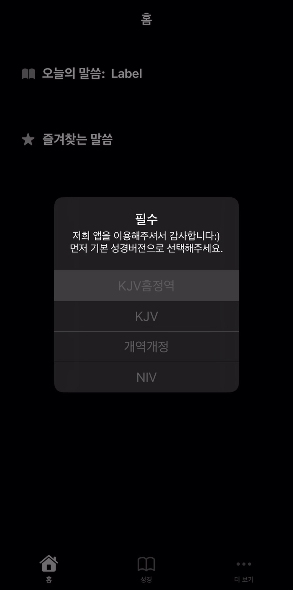
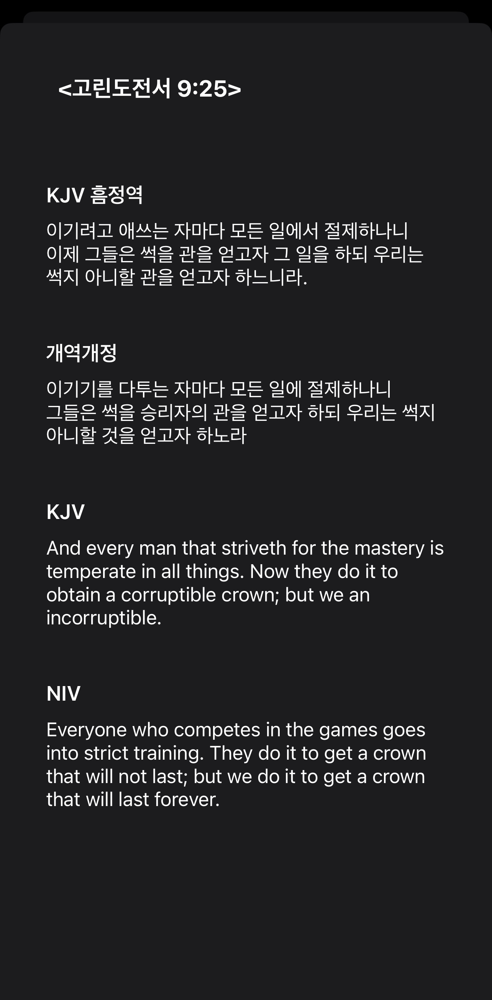
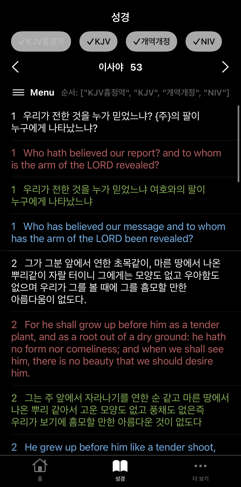
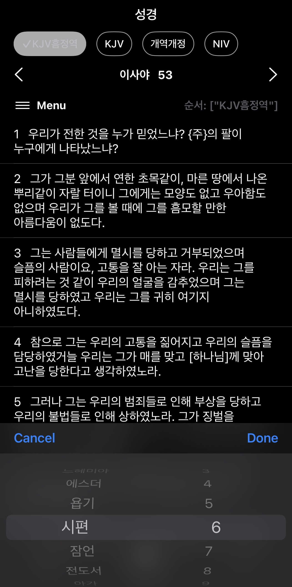
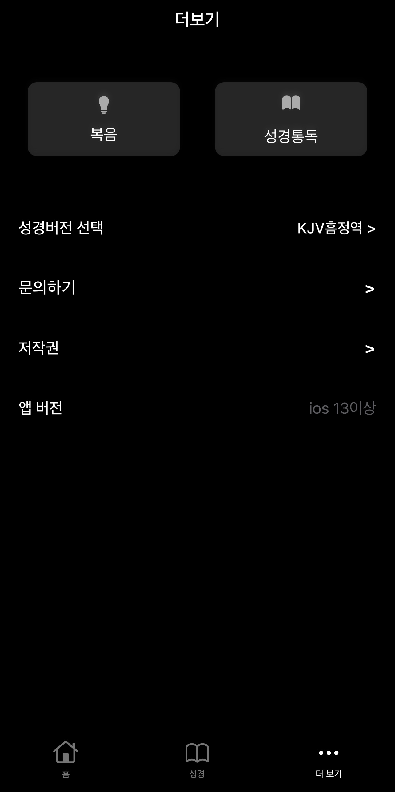
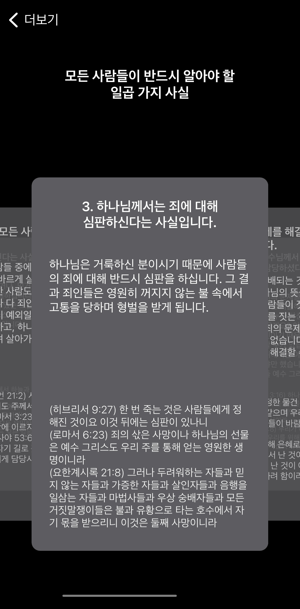
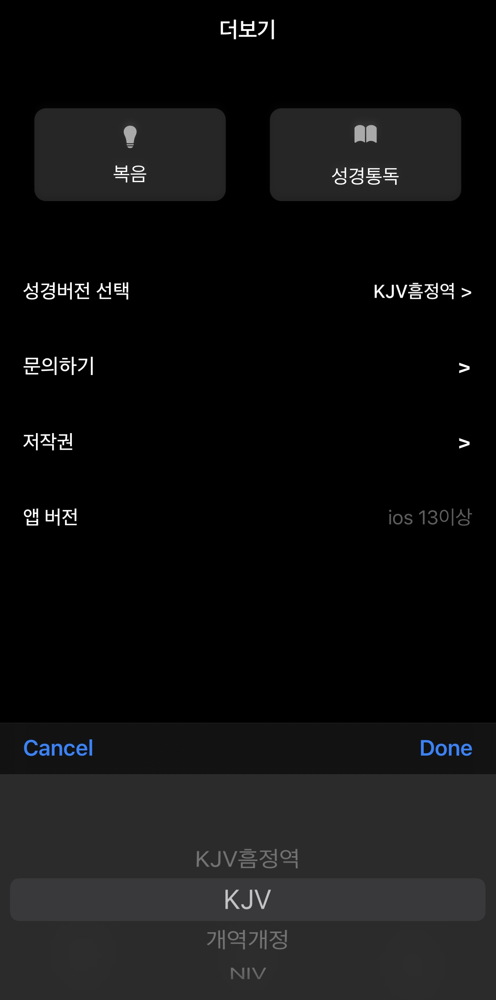
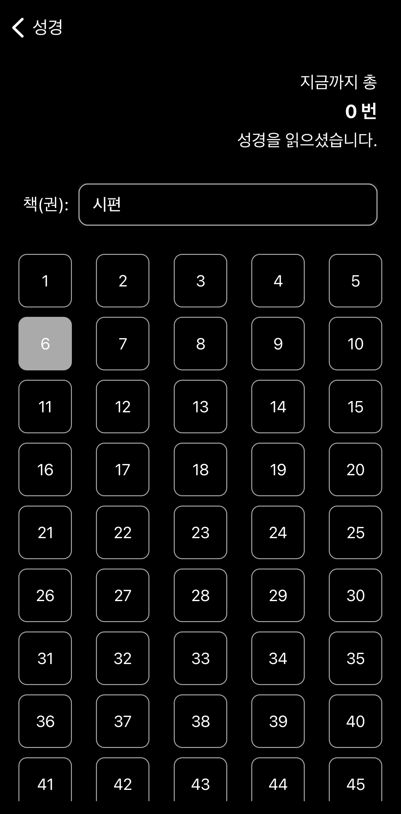
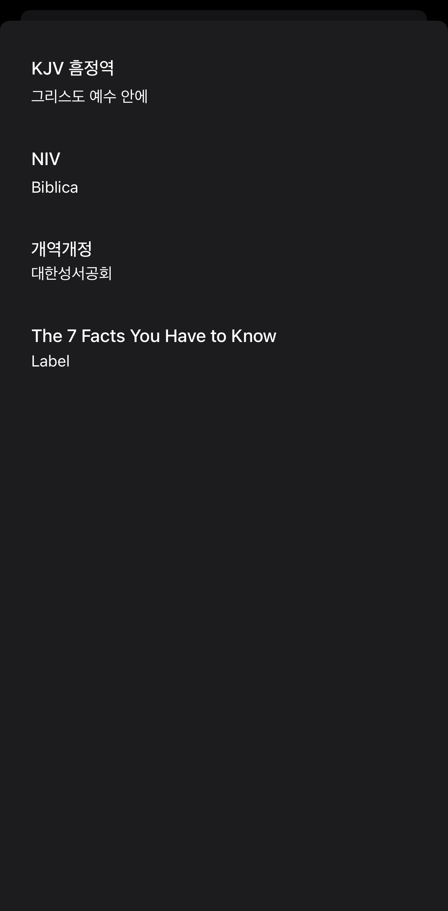

# LordBible

## 프로젝트 개요

- KJV, NIV, 개역개정, KJV흠정역 제공하는 성경 어플리케이션

[클릭: 시연 영상 보러가기](doc/mov/시연영상.mp4)

### 1. 주요 기능
- 4가지 버전의 성경말씀 제공

#### 페이지 구조
- 홈(home)
    - 오늘의 말씀(랜덤)
    - 즐겨찾는 말씀
- 성경(bible)
    - 성경 말씀 버전
    - 말씀 즐겨찾기
    - 읽기 완료
- 더보기(more)
    - 읽은 말씀 목록
    - 성경 버전 선택
    - 문의 메일 보내기

### 2. 개발 일정

#### 2022.9.1~2022.11.10
| 항목              | 기간                      | 상태  |
|-----------------|-------------------------|-----|
| swift 언어 공부 | 2022/09/01 – 2022/09/30 | 완료  |
| 제공 서비스 선별/확립    | 2022/10/01 – 2021/10/05 | 완료  |
| 모바일 설계    | 2022/10/06 – 2021/10/19 | 완료  |
| 테스트    | 2022/10/20 – 2021/10/31 | 완료  |
| 오류수정    | 2022/11/01 – 2021/11/07 | 완료  |
| 깃허브 업로드    | 2022/11/10 | 완료  |

## 프로젝트 실행

### 1. 요구 사항

#### Swift application
- iOS >= 13

### 2. 설치 방법

#### Swift application
- simulator 또는 아이폰/아이패드에서 실행

## 최종 구현 화면

#### - 초기화면

  

#### - 홈화면

#### - 성경말씀

#### - 더보기

